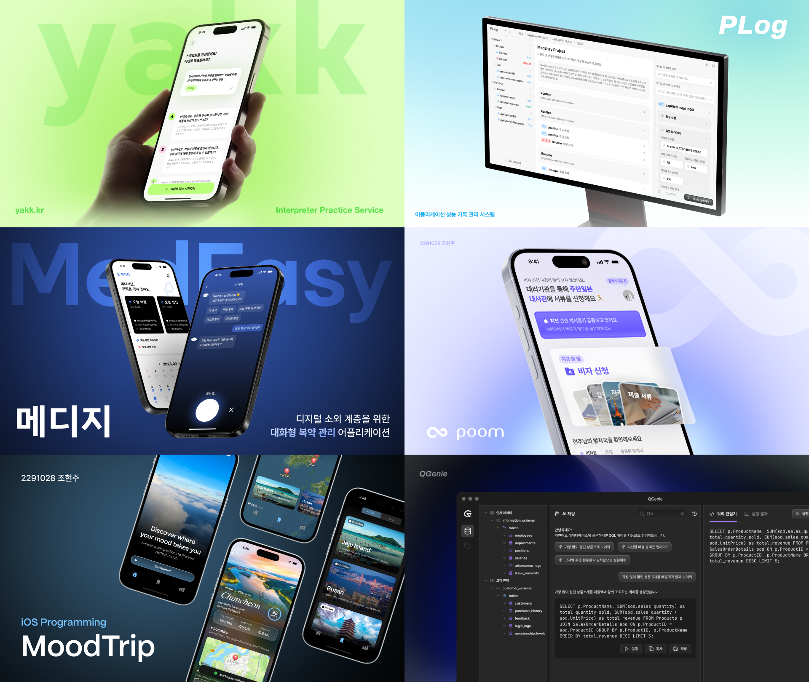
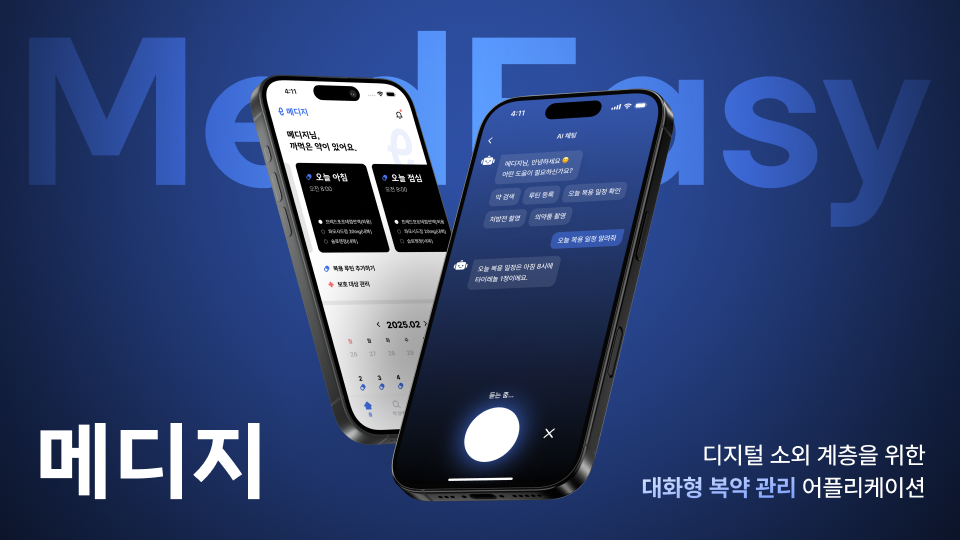
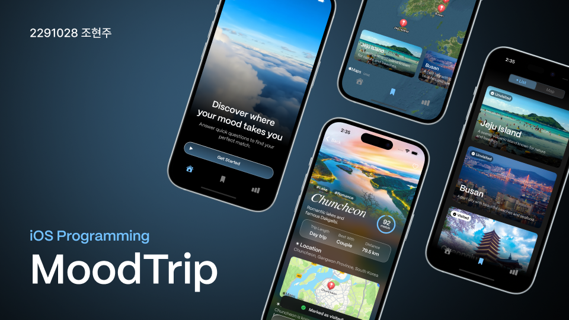

## 💫 About Me

  

Hi there👋 I'm **Hyunju Cho**!

I'm a **UX/UI Designer & Frontend Developer** 👩🏻‍💻💭

## 🚀 Projects

| | [**💊 메디지**](https://github.com/team-medeasy) | [**📚 채크**](https://github.com/ChackTeam/Chack) | [**✈️ MoodTrip**](https://github.com/hyynjju/MoodTrip) | [**🌏 품**](https://www.figma.com/design/AcciIrsdLuedTcOn94sB6x/Poom---UX-UI-Design?node-id=0-1&t=KK93oH5BGJklErkE-1) |
|--|-------------|----------------|----------------|----------------|
| **Preview** |  |  |  |  |
| **Period** | 2025.02 ~ 2025.06 | 2024.09 ~ 2024.12 | 2025.03 ~ 2025.06 | 2025.03 ~ 2025.06 |
| **Description** | 디지털 소외 계층을 위한 **복약 관리 어플** | 독서 습관 형성을 위한 **독서 기록 어플** | 감정 설문 기반 **국내 여행지 추천 어플** | **해외 정착 초기 한인을 위한 커뮤니티** 서비스 |
| **Frameworks** |  | |  | |
| **My Role** | Frontend 100% UX/UI Design 100% | Frontend 100% UX/UI Design 100% | Frontend 100% UX/UI Design 100% | UX/UI Design 100% (개인 디자인 프로젝트) |

## 💻 Tech Stack

### 📝 Languages

### 📚 Frameworks & Libraries

### 🎨 Design Tools

## 📮 Contact Me

 

