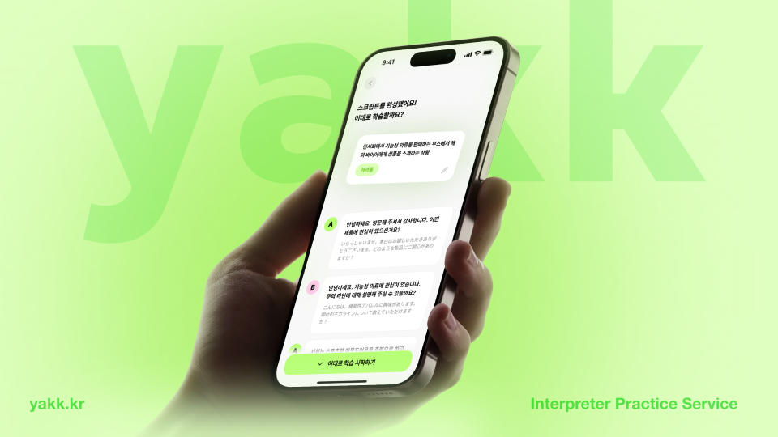
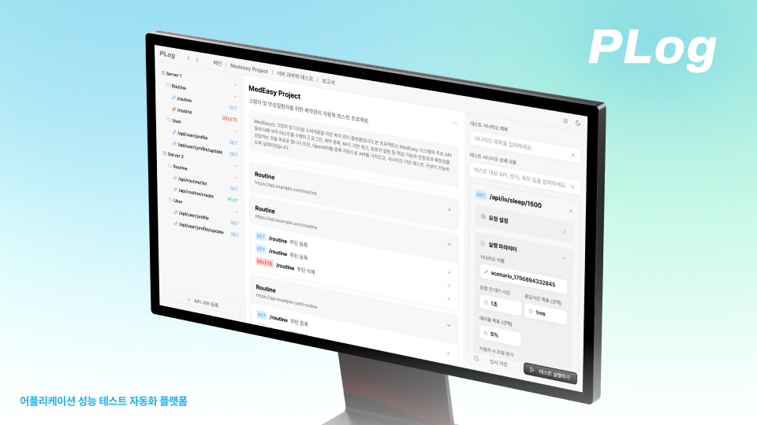
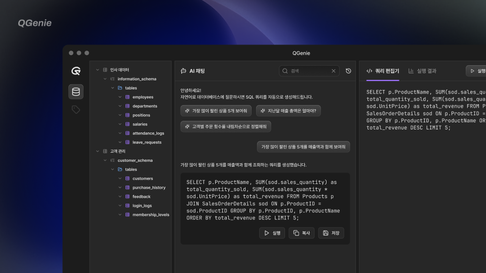

## 💫 About Me

Hi there👋 I'm **Hyunju Cho**!

I'm a **UX/UI Designer & Frontend Developer** 👩🏻‍💻💭

## 🚀 Projects

| | [**🗣️ yakk**](https://github.com/yakk-kr/yakk) | [**📊 PLog**](https://github.com/team-Plog) | [**💊 메디지**](https://github.com/team-medeasy) |
|--|-------------|-------------|-------------|
| **Preview** |  |  |  |
| **Period** | 2025.09 | 2025.08 ~ 2025.09 | 2025.02 ~ 2025.06 |
| **Description** | **동시통역 학습** 서비스 | 애플리케이션 **성능 테스트 자동화** 플랫폼 | 디지털 소외 계층을 위한 **복약 관리 어플** |
| **Frameworks** |  |  |  |
| **My Role** | Frontend 100% UX/UI Design 100% | UX/UI Design 100% | Frontend 30% UX/UI Design 100% |

| | [**✈️ MoodTrip**](https://github.com/hyynjju/MoodTrip) | [**🌏 품**](https://www.figma.com/design/AcciIrsdLuedTcOn94sB6x/Poom---UX-UI-Design) | [**📶 QGenie**](https://github.com/Queryus) |
|--|-------------|-------------|-------------|
| **Preview** |  |  |  |
| **Period** | 2025.03 ~ 2025.06 | 2025.03 ~ 2025.06 | 2025.07 ~ 2025.08 |
| **Description** | 감정 설문 기반 **국내 여행지 추천 어플** | 해외 정착 초기 한인을 위한 **커뮤니티 서비스** | 대화형 **SQL 질의** 플랫폼 |
| **Frameworks** |  |  |  |
| **My Role** | Frontend 100% UX/UI Design 100% | UX/UI Design 100% (개인 디자인 프로젝트) | UX/UI Design 100% |

## 💻 Tech Stack

### 📝 Languages

### 📚 Frameworks & Libraries

### 🎨 Design Tools

## 📮 Contact Me

